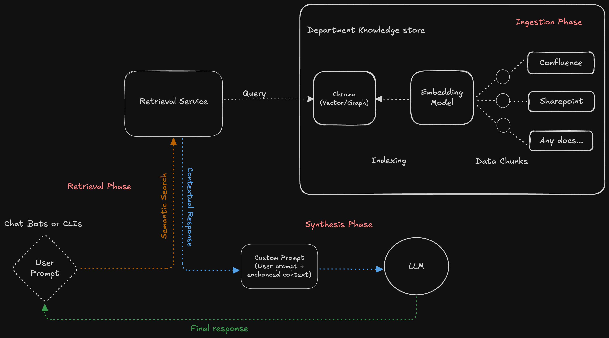

# Basic RAG Pipeline – Overview

This repository outlines the architecture for a **Retrieval-Augmented Generation (RAG)** based assistant to help any engineers query internal documentation.

---

## Overview

Above RAG system is split into three main phases:

### Ingestion Phase
- Documents from **Confluence**, **SharePoint**, or any other internal sources are indexed.
- Stored as embeddings using **Chroma (Vector/Graph)** in a centralized **Department Knowledge Store**.

### Retrieval Phase
- User prompt is received via a **ChatBot or CLI**.
- **Retrieval Service** performs semantic search against the vector DB.
- Returns contextually relevant documents.

### Synthesis Phase
- Retrieved context is combined with the user query to create a **Custom Prompt**.
- This prompt is passed to an **LLM**, which generates the final response.
- Final response is delivered back to the user.
