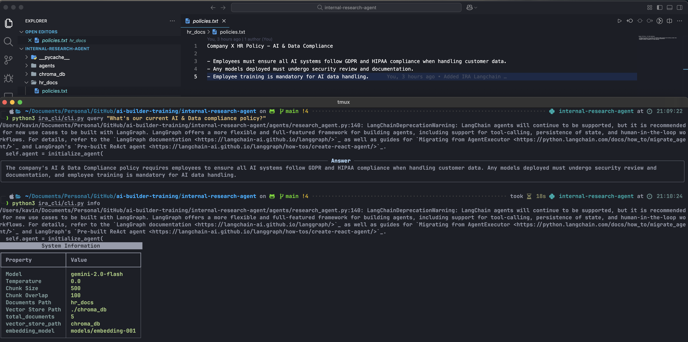
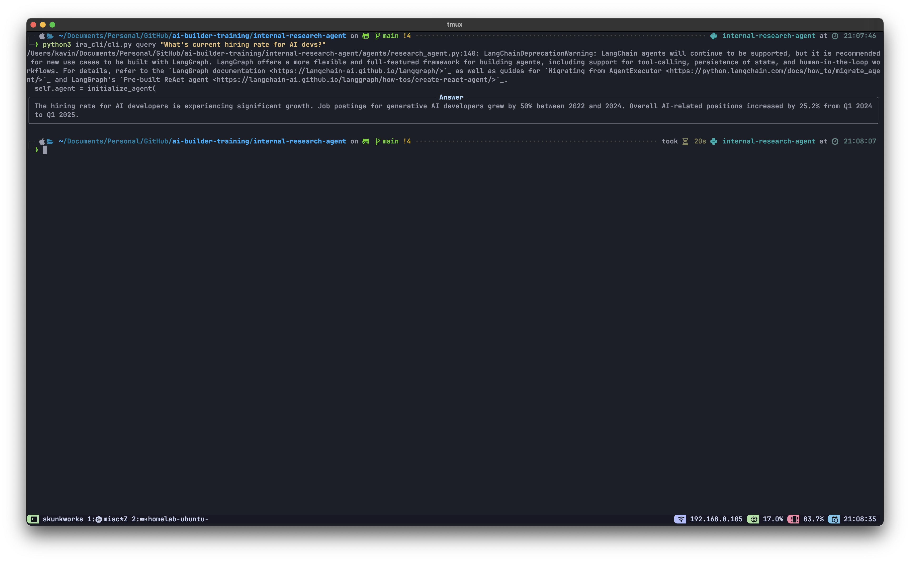
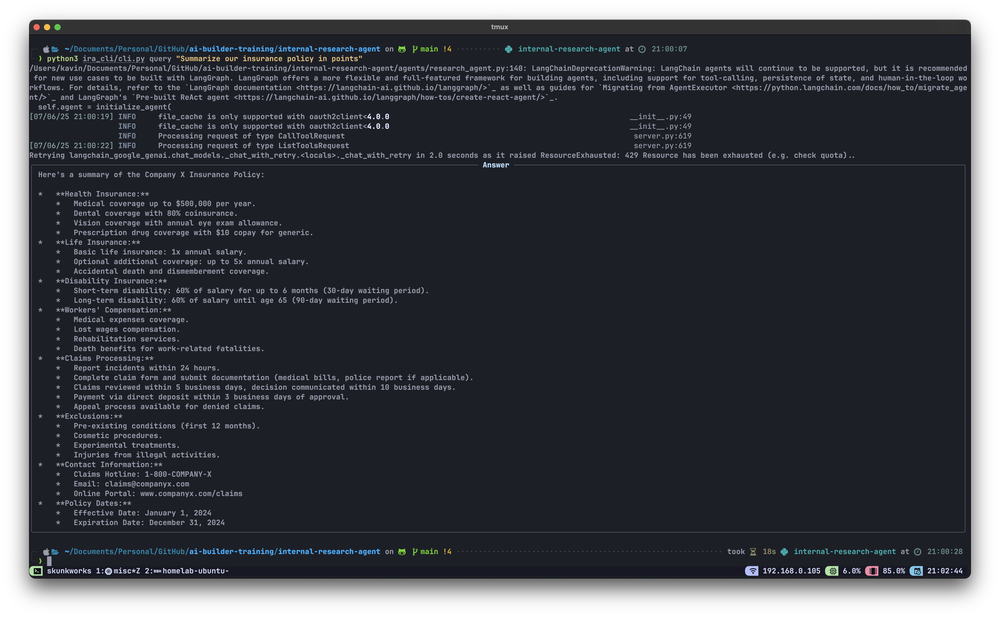

# Internal Research Agent

A modular, CLI-driven AI research assistant for querying internal documents and Google Docs (via MCP). Co-authoered by Cursor :)

## Features

- **RAG (Retrieval-Augmented Generation)** over local/internal docs
- **Web search** (Tavily)
- **Google Docs integration** via MCP server (for insurance/company docs)
- CLI for querying, adding docs, and system info

## Overview
Below are some example screenshots of the agent in action:

<p align="center">
  
  <br/>
  <em>RAG Output: Retrieval-Augmented Generation over internal docs</em>
</p>

<p align="center">
  
  <br/>
  <em>Web Search Output: Real-time web search results using Tavily</em>
</p>

<p align="center">
  
  <br/>
  <em>Google Docs Output: Company policy retrieval via MCP integration</em>
</p>


## Quick Start

```bash
# Clone the repository
git clone https://github.com/Kavinraja-G/ai-builder-training.git
cd ai-builder-training/internal-research-agent

# Set up virtual environment
python -m venv venv
source venv/bin/activate  # On Windows: venv\Scripts\activate

# Install dependencies
pip install -r requirements.txt
```

## Setup

### 1. Environment Variables

Create a `.env` file in the project root:

```env
# Required API Keys
GEMINI_API_KEY=your_gemini_api_key_here
TAVILY_API_KEY=your_tavily_api_key_here

# Google Docs MCP Integration (Optional - can be hardcoded)
GOOGLE_APPLICATION_CREDENTIALS=/absolute/path/to/your/service-account.json
GOOGLE_FOLDER_ID=your_google_drive_folder_id

# Optional Configuration
MODEL_NAME=gemini-2.0-flash
TEMPERATURE=0.0
MAX_RETRIES=2
CHUNK_SIZE=500
CHUNK_OVERLAP=100
DOCS_PATH=hr_docs
VECTOR_STORE_PATH=./chroma_db
MAX_SEARCH_RESULTS=5
```

### 2. API Keys Setup

#### Google Gemini API
1. Go to [Google AI Studio](https://makersuite.google.com/app/apikey)
2. Create a new API key
3. Set as `GEMINI_API_KEY` in your `.env` file

#### Tavily Search API
1. Go to [Tavily](https://tavily.com/)
2. Sign up and get your API key
3. Set as `TAVILY_API_KEY` in your `.env` file

#### Google Drive API (for MCP integration)
1. Create a [Google Cloud Project](https://console.cloud.google.com/)
2. Enable Google Drive API and Google Docs API
3. Create a service account and download the JSON key
4. Share your target Google Drive folder with the service account email
5. Set the path to your JSON key as `GOOGLE_APPLICATION_CREDENTIALS`

## Usage

### Initialize the Agent

```bash
python -m ira_cli init
```

### Ask Questions

#### Single Question
```bash
python -m ira_cli query "What are the company's insurance policies?"
```

#### Interactive Mode
```bash
python -m ira_cli query --interactive
```

### Add Documents

```bash
python -m ira_cli add-docs /path/to/document1.pdf /path/to/document2.docx
```

### Search Vector Store

```bash
python -m ira_cli search "employee benefits"
```

### System Information

```bash
python -m ira_cli info
```

## CLI Commands

| Command | Description |
|---------|-------------|
| `init` | Initialize the research agent and vector store |
| `query <question>` | Ask a single question |
| `query --interactive` | Run in interactive mode |
| `add-docs <files...>` | Add documents to the vector store |
| `search <query>` | Search the vector store |
| `info` | Show system information |

## Features Explained

### RAG (Retrieval-Augmented Generation)
- Processes local documents (PDF, DOCX, TXT)
- Creates embeddings and stores in ChromaDB
- Retrieves relevant context for questions

### Web Search
- Uses Tavily API for real-time web search
- Provides current information and recent events

### Google Docs Integration
- Connects to Google Drive via MCP (Model Context Protocol)
- Fetches insurance and company documents
- Automatically available when asking about company policies

## License

This project is part of the [ai-builder-training](https://github.com/Kavinraja-G/ai-builder-training) repository.