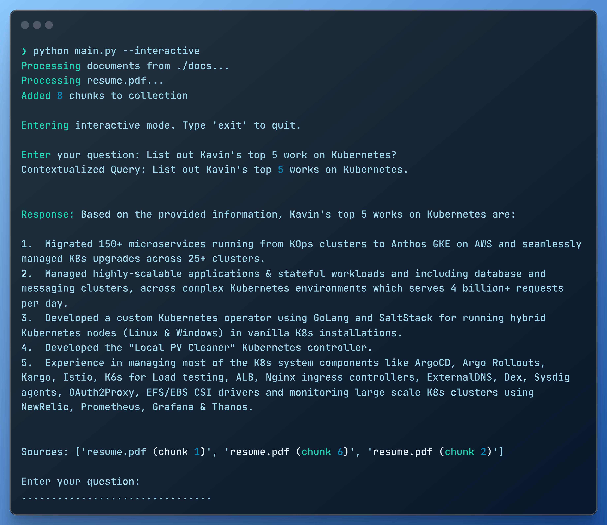

# Simple RAG Bot

A simple **Retrieval-Augmented Generation (RAG)** bot that can process documents and answer questions based on their content. This is entirely based on the very good tutorial on [RAG from Scratch](https://blog.futuresmart.ai/building-rag-applications-without-langchain-or-llamaindex#heading-introduction) and some Cursor magic! Well, we're living in AI era.

## How it works?
*Sample response from the bot on learning contexts from resume doc.*



## Installation

1. Clone the repository:
```bash
git clone <repository-url>
cd simple-rag-bot
```

2. Create and activate a virtual environment:
```bash
python -m venv venv
source venv/bin/activate  # On Windows: venv\Scripts\activate
```

3. Install the package in development mode:
```bash
pip install -e .
```

## Usage

1. Set your Gemini API key:
```bash
export GEMINI_API_KEY='your-api-key-here'
```

2. Place your documents in the `docs` folder (supports .txt, .pdf, and .docx files)

3. Run the bot:

Interactive mode:
```bash
python main.py --interactive
```

Single query:
```bash
python main.py --query "Your question here"
```

Process documents from a different folder:
```bash
python main.py --docs /path/to/documents --query "Your question here"
```

## Features

- Supports multiple document formats (TXT, PDF, DOCX)
- Interactive mode for continuous questioning
- Single query mode for quick answers
- Source attribution for answers
- Conversation history tracking